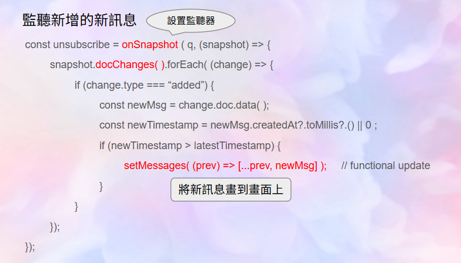

# 💘 MatchU — 線上交友配對平台

MatchU 是一個以 Next.js 和 Firebase 打造的現代化交友平台，使用者可以編輯個人檔案、喜歡其他用戶並建立配對，進一步進行即時聊天互動。專案致力於提供直覺、快速、即時的配對與聊天體驗。

---

##  目錄

- [主要功能](#主要功能)
- [使用者故事](#使用者故事)
- [頁面預覽](#頁面預覽)
  - [首頁（登入頁面）](#首頁登入頁面)
  - [個人主頁](#個人主頁)
  - [Explore搜尋頁面](#Explore搜尋頁面)
  - [配對列表](#配對列表)
  - [聊天頁面](#聊天頁面)
- [流程圖](#流程圖)
- [使用技術](#使用技術)
- [技術重點說明](#技術重點說明)
  - [1.如何顯示雙方的聊天紀錄 & 畫出新訊息](#一如何顯示雙方的聊天紀錄--畫出新訊息)
  - [2.使用自訂 hook-usehasmatch.ts](#二使用自訂-hook---usehasmatchts)
- [開發與執行](#開發與執行)
- [專案目的與背景](#專案目的與背景)
- [作者](#作者)
- [上線網址](#上線網址)

---

## 主要功能

- 使用者註冊 / 登入（Firebase Authentication）
- 編輯個人資料（暱稱、自我介紹、興趣、頭像、星座、職業）
- 推薦異性使用者（Explore 配對機制）
- 雙方互按喜歡即配對成功（Match 機制）
- 即時聊天（Firestore + Realtime Database）
- 支援上線狀態、未讀訊息、圖片傳送

---

## 使用者故事
作為一個正在尋找伴侶的使用者，<br>
我想要瀏覽系統推薦的異性資料，<br>
進而找到合適的對象，展開互動。

---
## 頁面預覽

### 首頁（登入頁面）
使用者進入網站後，首先會看到登入／註冊頁面。透過 Firebase Authentication 實現帳號驗證機制，登入後可進入完整配對功能。


### 個人主頁
使用者可以查看並編輯個人資料，包括暱稱、自我介紹、興趣標籤、大頭貼等，資料儲存於 Firestore 和 Firebase Storage。


### Explore 搜尋頁面
探索頁面會根據使用者性別推薦異性對象，每次顯示一位，使用者可以點擊like配對或next切換下一位。配對成功後可以進入配對列表以及聊天頁面。


### 配對列表
所有配對成功的對象皆會顯示於此，可以查看對方目前是否在線上，以及是否有未讀之訊息。


### 聊天頁面
與配對成功的對象進行即時聊天，支援文字、圖片、未讀訊息提示與上線狀態顯示。


---

## 流程圖


---

## 使用技術

- **前端框架**：Next.js 14 (App Router) + TypeScript
- **UI 工具**：Tailwind CSS、Heroicons
- **後端服務**：Firebase
  - Firestore（聊天訊息、使用者資料）
  - Realtime Database（上線狀態）
  - Firebase Auth（使用者驗證）
  - Firebase Storage（大頭貼上傳）

---
## 技術重點說明
### 一、如何顯示雙方的聊天紀錄 & 畫出新訊息





### 二、使用自訂 Hook - useHasMatch.ts


---

## 開發與執行

1. 安裝依賴：

```bash
npm install
```

2. 設定環境變數 .env.local：

```env
NEXT_PUBLIC_FIREBASE_API_KEY=MY_API_KEY
NEXT_PUBLIC_FIREBASE_AUTH_DOMAIN=MY_AUTH_DOMAIN
NEXT_PUBLIC_FIREBASE_PROJECT_ID=MY_PROJECT_ID
NEXT_PUBLIC_FIREBASE_STORAGE_BUCKET=...
NEXT_PUBLIC_FIREBASE_MESSAGING_SENDER_ID=...
NEXT_PUBLIC_FIREBASE_APP_ID=...
```

3. 啟動本地伺服器：

```bash
npm run dev
```
---

## 專案目的與背景

我會想開發 MatchU 戀愛交友網站，是因為我本身相當重視人與人之間的情感交流與家庭關係(巨蠍座)。因此，我希望能透過自己的特質，打造一個溫暖、真誠的配對平台，讓使用者彼此能有深入的互動交流與連結，找到命中注定的另一伴。

本專案整合了 Next.js 與 Firebase 技術，實作一套具備配對邏輯與即時聊天功能的交友平台，完成前後端整合，使用Vercel來完成雲端部署。

---

## 作者

由 王繹儼 製作，若有任何建議或問題，歡迎提 issue 或聯絡作者。

---

## 上線網址
https://match-u-yiyan777s-projects.vercel.app/