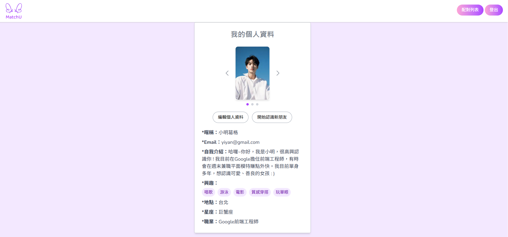
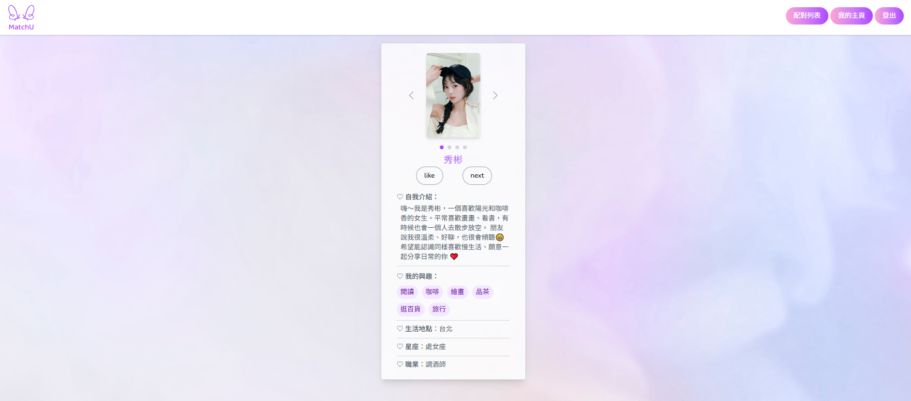

# 💘 MatchU — 線上交友配對平台

MatchU 是一個以 Next.js 和 Firebase 打造的現代化交友平台，使用者可以編輯個人檔案、喜歡其他用戶並建立配對，進一步進行即時聊天互動。專案致力於提供直覺、快速、即時的配對與聊天體驗。

---

##  目錄

- [主要功能](#主要功能)
- [使用技術](#使用技術)
- [開發與執行](#開發與執行)
- [頁面預覽](#頁面預覽)
- [專案目的與背景](#專案目的與背景)
- [作者](#作者)
- [上線網址](#上線網址)

---

## 主要功能

- 使用者註冊 / 登入（Firebase Authentication）
- 編輯個人資料（暱稱、自我介紹、興趣、頭像、星座、職業）
- 推薦異性使用者（Explore 配對機制）
- 雙方互按喜歡即配對成功（Match 機制）
- 即時聊天（Firestore + Realtime Database）
- 支援上線狀態、未讀訊息、圖片傳送

---

## 使用技術

- **前端框架**：Next.js 14 (App Router) + TypeScript
- **UI 工具**：Tailwind CSS、Heroicons
- **後端服務**：Firebase
  - Firestore（聊天訊息、使用者資料）
  - Realtime Database（上線狀態）
  - Firebase Auth（使用者驗證）
  - Firebase Storage（大頭貼上傳）

---

## 開發與執行

1. 安裝依賴：

```bash
npm install
```

2. 設定環境變數 .env.local：

```env
NEXT_PUBLIC_FIREBASE_API_KEY=你的API_KEY
NEXT_PUBLIC_FIREBASE_AUTH_DOMAIN=你的AUTH_DOMAIN
NEXT_PUBLIC_FIREBASE_PROJECT_ID=你的PROJECT_ID
NEXT_PUBLIC_FIREBASE_STORAGE_BUCKET=...
NEXT_PUBLIC_FIREBASE_MESSAGING_SENDER_ID=...
NEXT_PUBLIC_FIREBASE_APP_ID=...
```

3. 啟動本地伺服器：

```bash
npm run dev
```

---

## 頁面預覽

| 首頁（登入） | 個人頁面 |
|--------------|----------|
|  |  |

| Explore 頁面 | 聊天頁面 |
|--------------|----------|
|  |  |

---

## 專案目的與背景

我想開發 MatchU 戀愛交友網站，是因為我本身是水象星座（巨蟹座），非常重視人與人之間的情感交流。因此，希望能透過自己的特質，打造一個溫暖、真誠的配對平台，讓使用者之間能有更深入的互動與連結。

本專案整合了 Next.js 與 Firebase 技術，實作一套具備配對邏輯與即時聊天功能的交友平台，並完成前後端整合與雲端部署。

---

## 作者

由 王繹儼 製作，若有任何建議或問題，歡迎提 issue 或聯絡作者。

---

## 上線網址
https://match-u-yiyan777s-projects.vercel.app/